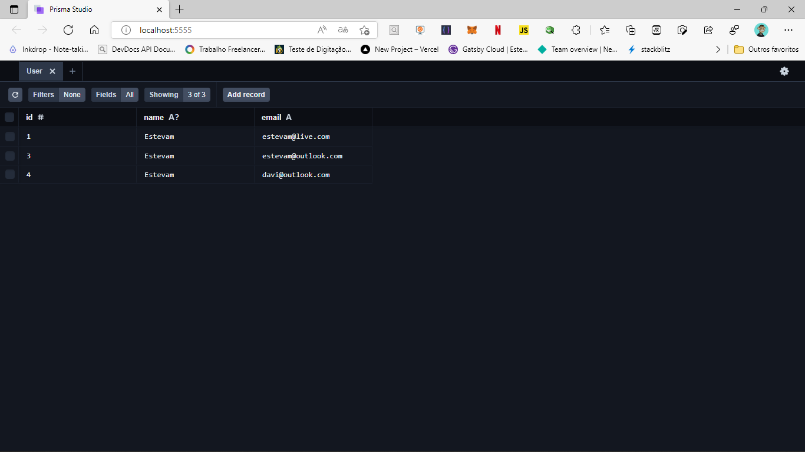

<h1 align="center">
  <center>Prisma: o ORM Node.js
</center>
</h1>

## 👨🏼‍💻 Developer

- [Estevam Souza](https://www.linkedin.com/in/estevam-souza)

## ✋🏻 Pré-requisitos

- [Node.js](https://nodejs.org/en/)
- [Yarn](classic.yarnpkg.com/en/docs/install)

## 🔥 Instalação e execução

1. Faça um clone desse repositório;
2. git clone https://github.com/Estevamsl/prisma-mysql
3. Entre na pasta `cd prisma-mysql`;
4. Rode `yarn` ou rode o app com npm: npm init -y para criar um project padrão
5. Rode `yarn prisma generate` para instalar os models do prisma no projeto
6. Rode `yarn dev` ou `npm run dev` para rodar a aplicação;
7. Acesse a URL `http://localhost:4003`;

## Como mostrar log da aplicação?

```ts
const prismaClient = new PrismaClient({
  log: ["error", "info", "query", "warn"],
});
```

## Como incluir informações em um select com relacionamento

```ts
const product = await prismaClient.product.findFirst({
  where: {
    id,
  },
  include: {
    ProductCategory: {
      // Seleciona o model
      include: {
        category: true, // Dentro do model seleciono o relacionamento que quero trazer completo.
      },
    },
  },
});
```

Esse projeto está sob a licença MIT. Veja o arquivo [LICENSE](LICENSE.md) para mais detalhes.

---
